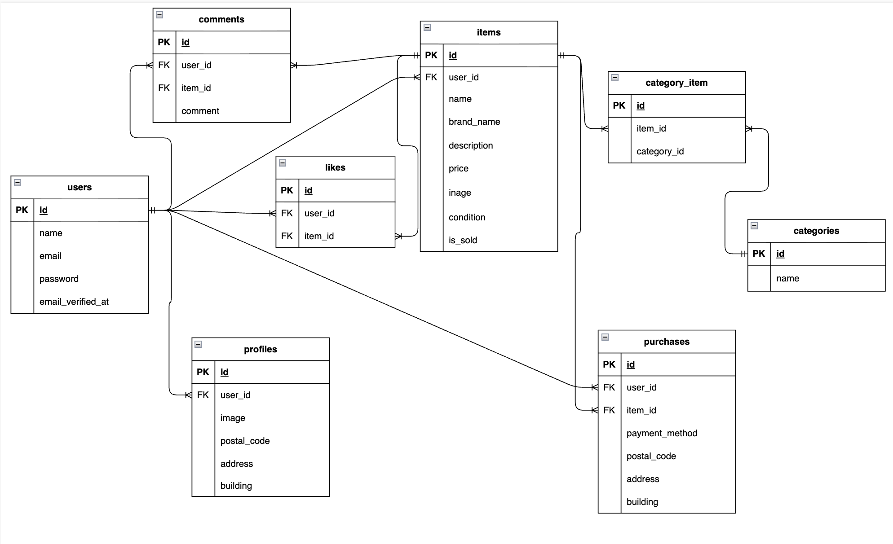

# flea-market

## 環境構築

Dockerビルド

git clone git@github.com:miho-102/flea-market.git
cd flea-market
docker-compose up -d --build

MacのM1・M2チップ搭載PCの場合、以下のエラーが発生することがあります。

no matching manifest for linux/arm64/v8 in the manifest list entries

その場合は、docker-compose.ymlのmysqlサービスに以下を追加してください。

mysql:
platform: linux/x86_64
image: mysql:8.0.26

## Laravel環境構築

1. docker-compose exec php bash
2. composer install
3. 「.env.example」ファイルを 「.env」ファイルに命名を変更。または、.envファイルを作成します
4. .env以下の環境変数を追加

DB_CONNECTION=mysql
DB_HOST=mysql
DB_PORT=3306
DB_DATABASE=laravel_db
DB_USERNAME=laravel_user
DB_PASSWORD=laravel_pass

アプリケーションキーの作成
php artisan key:generate
マイグレーションの実行
php artisan migrate
シーディングの実行
php artisan db:seed
シンボリックリンク作成
php artisan storage:link

## 利用技術(実行環境)

- PHP 7.3 以上（PHP 8.x 対応）
- Laravel 8.83.29
- MySQL 8.0.26
- Docker
- HTML
- CSS

## ER図

## 実装機能
### 認証機能
- 会員登録
- ログイン
- ログアウト

### 商品機能
- 商品一覧表示
- 商品詳細表示
- 商品出品
- 商品検索

### マイページ機能
- プロフィール編集
- 出品商品一覧表示
- 購入商品一覧表示

### コメント機能
- コメント投稿
- コメント表示

### いいね機能
- いいね登録
- マイリスト表示

### 購入機能
- 商品購入
- Stripe決済
- 支払い方法選択
- 配送先変更

### バリデーション
- 出品機能
- コメント投稿
- プロフィール編集
- 購入機能
- 配送先変更

## テーブル構成
- users
- items
- categories
- category_item
- comments
- likes
- purchases
- profiles

## テスト
### PHPUnit
- LoginTest
- RegisterTest

## URL
- 開発環境: http://localhost
- phpMyAdmin: http://localhost:8080

## 補足
メール認証誘導画面は作成済みです。

確認URL:
http://localhost/email/verify

現在は必須要件に合わせて、会員登録後はプロフィール設定画面へ遷移します。
MailHog未導入のため、実メール送信およびメール内認証リンクからの認証完了確認は未実施です。